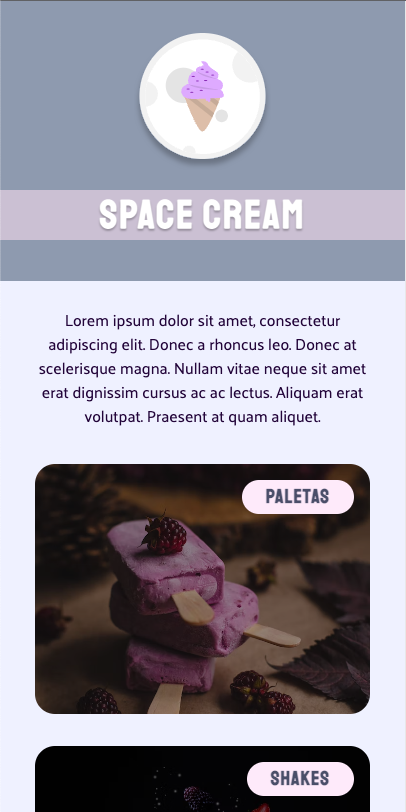

# Stage 03 - Challenge 03

🚀 **Projeto desenvolvido no nível 03 do programa de formação Explorer da Rocketseat.**

 

## 📝 **Conceitos trabalhados**

**Responsividade**

- Unidades de medidas relativas e flexíveis
- Transições e transformações no CSS
- Variáveis no CSS
- Mobile first

#### 👉🏽 Clique **[aqui](https://eduardofariasdev.github.io/stage03-challenge03/)** e abra esse projeto no seu seu navegador.
